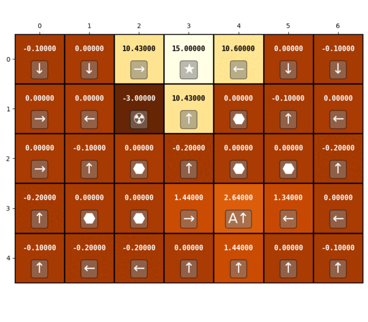

## Maze Solver
An implementation of *value iteration* algorithm to solve maze problem.

<br>

#### Requirements:
- Python 3.x
- numpy
- matplotlib
- [texttable](https://github.com/foutaise/texttable/) (included)

<br>

#### To run code:
```
python ./main.py
```

<br>

#### Help
To define your own maze create a list of strings which each element represent a row in maze.  
<br>
##### Maze Symbols:
| Symbol | Description |
| ------ | ----------- |
| # | wall or obstacle (the maze is surrounded by walls as default) |
| . | empty grid cell |
| * | general goal |
| A-Z| special goal/state |
| ! | pitfall |
| @ | agent origin(starting state) |

Example:
```python
plan = [
    '...*...',
    '..!.#..',
    '..#.#..',
    '.#..A..',
    '.......',
]
```
Then you have to define your rewards or penalties by a *dict* like here:
```python
rewards = {
    '*': 15.0,         # goal reward
    '!': -3.0,         # pitfall negative reward
    'A': 2.0,          # custom state reward
    'hit_wall': -1.0,  # hitting a wall negative reward
    'movement': -0.1   # each move negative reward(cost)
}
```
Finally run value iteration algorithm:
```python
maze = SimpleMaze(plan=plan, rewards=rewards, action_prob=0.8)
maze.run_value_iteration(
    gamma=0.9, max_error=0.00001,
    max_iterations=1000, normal=False
)
```

<br>

